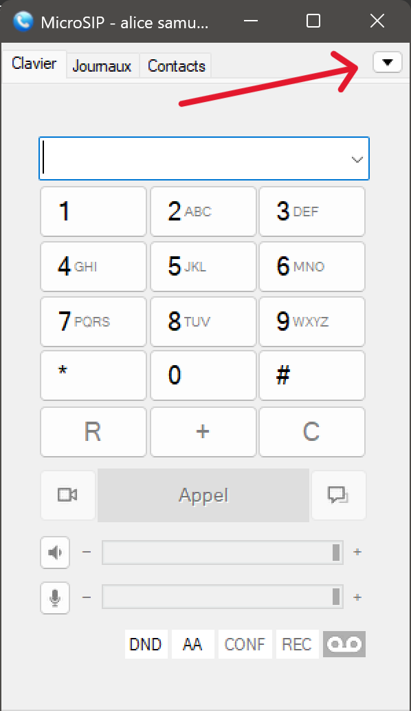

# DOCUMENTATION

Pour l’installation d’asterisk, j’ai suivi ce [tutoriel](https://doc.ubuntu-fr.org/asterisk).

En premier on installe les paquets :

    sudo apt install build-essential libxml2-dev libncurses5-dev linux-headers-$(uname -r) libsqlite3-dev libssl-dev libedit-dev uuid-dev libjansson-dev

Ensuite on créer le fichier asterisk comme ceci :

    mkdir /usr/src/asterisk

Et on se rend dans ce même dossier :

    cd /usr/src/asterisk

Et on install asterisk :

    wget : [https://downloads.asterisk.org/pub/telephony/asterisk/asterisk-22-current.tar.gz](https://downloads.asterisk.org/pub/telephony/asterisk/asterisk-22-current.tar.gz)

et on décompresse le fichier :

    tar -xvzf asterisk-22-current.tar.gz

on se déplace dans le fichier :

    cd asterisk-22.2.0/

et on lance la configuration avec :

    sudo ./configure --with-jansson-bundled

Il manque un paquet, donc on l’installe avec :

    sudo apt install pkg-config

On relance la configuration avec :

    sudo ./configure --with-jansson-bundled

Finalement, on fait :

    sudo make menuselect

Dans le menu qui s'affiche, je suis allé dans **Core Sound Package** et j’ai coché à l'aide de la touche Espace **CORE-SOUNDS-FR-ULAW**. Je quitte en pressant la touche Echap. Je vais ensuite dans **Music On Hold File Packages**, Je décoche **MOH-OPSOUND-WAV** et je coche **MOH-OPSOUND-ULAW**. Enfin, je vais dans **Extras Sound Packages** et je coche **EXTRA-SOUNDS-FR-ULAW**.

Je reviens à l'écran principal et j’appuie sur Echap pour terminer et je presse S pour sauvegarder.

Enfin je tape les commandes suivantes pour terminer l’installation :

    sudo make
    
    sudo make install
    
    sudo make samples
    
    sudo make config

Enfin je lance Asterisk avec :

    /etc/init.d/asterisk start

et je lance la console d’asterisk avec :

    sudo asterisk -rvvvv

J’ai ensuite procédé à la configuration des utilisateurs. J’ai d’abord modifié le fichier `pjsip.conf` en faisant :

    cd /etc/asterisk

    sudo nano pjsip.conf

Dans ce fichier, j’ai ajouté les configurations suivantes :

    language=fr; Default language setting for all users/peers

et aussi :

    [general]
    hasvoicemail = yes
    hassip = yes
    hasiax = yes
    callwaiting = yes
    threewaycalling = yes
    callwaitingcallerid = yes
    transfer = yes
    canpark = yes
    cancallforward = yes
    callreturn = yes
    callgroup = 1
    pickupgroup = 1
    nat = yes

Ensuite j’ai rajouter les lignes de configurations sans template :

    [6001]  ; Numéro SIP  
    type=friend  ; Type d'objet SIP (friend = utilisateur)
    host=dynamic  ; Vous pouvez vous connecter à ce compte SIP à partir de n’importe quelle adresse IP
    dtmfmode=rfc2833  ; Mode du DTMF
    disallow=all  ; Désactiver tous les codecs
    allow=ulaw  ; Activer les codecs µlaw
    fullname = Samuel RIGAUX  ; Nom complet de l'utilisateur (ce qui s'affiche sur le téléphone)
    username = samuel  ; Nom d'utilisateur
    secret=root  ; Mot de passe
    context = work  ; Contexte (exploité par le fichier extensions.conf)

## Sécurisation des appels par TLS

Tout d'abord on doit créer le fichiers qui va contenir les keys : 

    sudo mkdir /etc/asterisk/keys
    cd /etc/asterisk/keys

On créer des certificats (non officiels) comme ceci : 

    openssl req -x509 -newkey rsa:2048 -keyout private.key -out certificate.pem -days 365 -nodes

Ensuite il nous pose ces questions : 

    Country Name (2 letter code) [AU]: FR
    State or Province Name (full name) [Some-State]: Île-de-France
    Locality Name (eg, city) []: Paris
    Organization Name (eg, company) [Internet Widgits Pty Ltd]: MonEntreprise
    Organizational Unit Name (eg, section) []: IT
    Common Name (e.g. server FQDN or YOUR name) []:  iP de la machine (pour nous 172.20.10.5)
    Email Address []: 

Ensuite nous devons changer le fichier `pjsip.conf`, donc on se rend dans le dossier :

    cd /etc/asterisk
    sudo nano pjsip.conf

Et nous y rajoutons le contenue suivant  (en dessous de `[transport-udp]`) :

    [transport-tls]
    type=transport
    protocol=tls
    bind=0.0.0.0:5061
    cert_file=/etc/asterisk/keys/certificate.pem 
    priv_key_file=/etc/asterisk/keys/private.key 
    method=tlsv1_2

Pour sauvegarder les modifications, nous redémarrons asterisk : 

    sudo systemctl restart asterisk
    
Et nous vérifions si il n'y a pas d'erreurs : 

    sudo systemctl status asterisk

Ensuite nous pouvons lancer asterisk avec : 

    sudo asterisk -rvvvvv

Et dans la console asterisk nous pouvons vérifier si les transports sont bien présent : 

    pjsip show transports

Ce qui devrait nous donner ce résultat :

    VoIP*CLI> pjsip show transports
    
    Transport:  <TransportId........>  <Type>  <cos>  <tos>  <BindAddress....................>
    ==========================================================================================
    
    Transport:  transport-tls             tls      0      0  0.0.0.0:5061
    Transport:  transport-udp             udp      0      0  0.0.0.0:5060
    
    Objects found: 2
    
    VoIP*CLI>

Et nous pouvons aussi vérifier les utilisateurs avec :

    pjsip show endpoints

Ce qui nous donne ce résultat dans notre exemple : 

    VoIP*CLI> pjsip show endpoints
    
     Endpoint:  <Endpoint/CID.....................................>  <State.....>  <Channels.>
        I/OAuth:  <AuthId/UserName...........................................................>
            Aor:  <Aor............................................>  <MaxContact>
          Contact:  <Aor/ContactUri..........................> <Hash....> <Status> <RTT(ms)..>
      Transport:  <TransportId........>  <Type>  <cos>  <tos>  <BindAddress..................>
       Identify:  <Identify/Endpoint.........................................................>
            Match:  <criteria.........................>
        Channel:  <ChannelId......................................>  <State.....>  <Time.....>
            Exten: <DialedExten...........>  CLCID: <ConnectedLineCID.......>
    ==========================================================================================
    
     Endpoint:  alice                                                Not in use    0 of inf
         InAuth:  alice/alice
            Aor:  alice                                              5
          Contact:  alice/sip:alice@172.20.10.1:50124;transpor 216a4c2d23 NonQual         nan
      Transport:  transport-tls             tls      0      0  0.0.0.0:5061
    
     Endpoint:  bob                                                  Not in use    0 of inf
         InAuth:  bob/bob
            Aor:  bob                                                5
          Contact:  bob/sip:bob@172.20.10.6:62865;transport=TL 482a34547f NonQual         nan
      Transport:  transport-tls             tls      0      0  0.0.0.0:5061
    
     Endpoint:  martin                                               Unavailable   0 of inf
         InAuth:  martin/martin
      Transport:  transport-tls             tls      0      0  0.0.0.0:5061
    
    
    Objects found: 3
    
    VoIP*CLI>

Après ces étapes, vous devriez pourvoir vous connecter via Microsip ou PortSIP uc à vos utilisateurs en TLS. 

## Configuration sur MicroSIP 

Lancez MicroSIP sur votre PC 

Allez dans les paramètres : 

